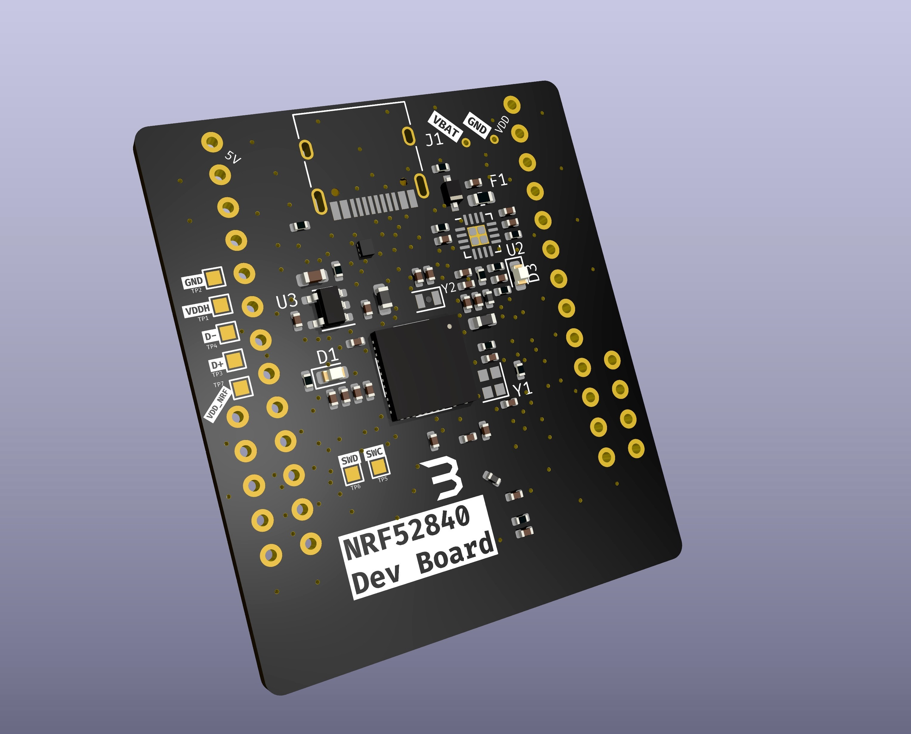

# byrandev (V1.0)
 nrf52840 dev board, highly experimental.
 The components based off the [mikoto](https://github.com/zhiayang/mikoto) board.
 I will do some finishing touches when I have the time.
 Since the board is two layered, it can be made affordably and be _directly integrated_ into larger boards with no issue.
 
### There are currently no instructions, I will write them sometime in the future :)

### PCB (28 GPIO pins)

 
 
#### PCB 3D File Raytraced Render in KiCAD

 

#### Real Images (working prototype from JLCPCB, HASL(PBF) 2 Layer, Black Solder Mask)

 
 

### Unsightly Image with more detail on the PCB

 

As with most open source projects, I am not liable for any issues, and no warranty is provided. Please use at your own risk and make this world a better place :)
